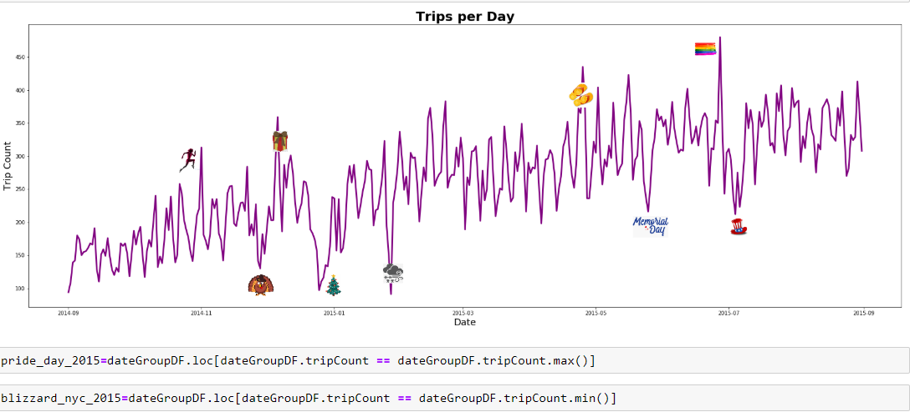
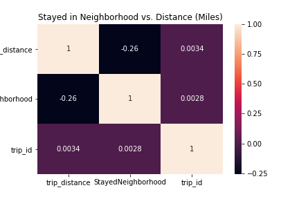
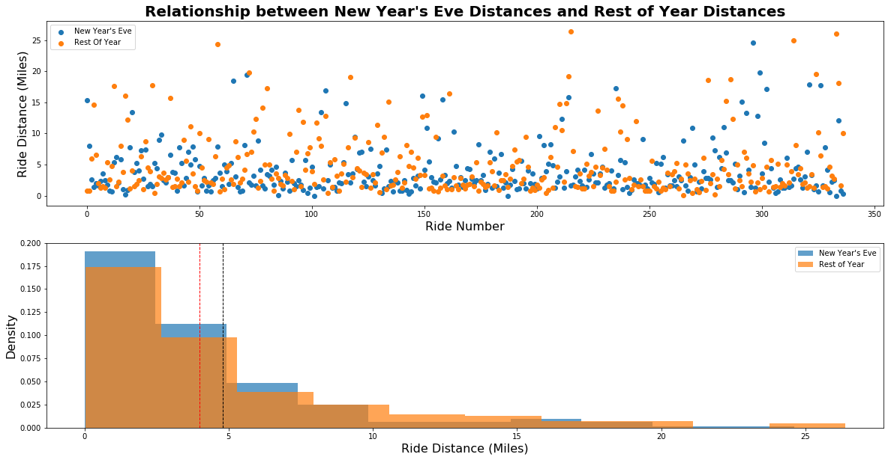
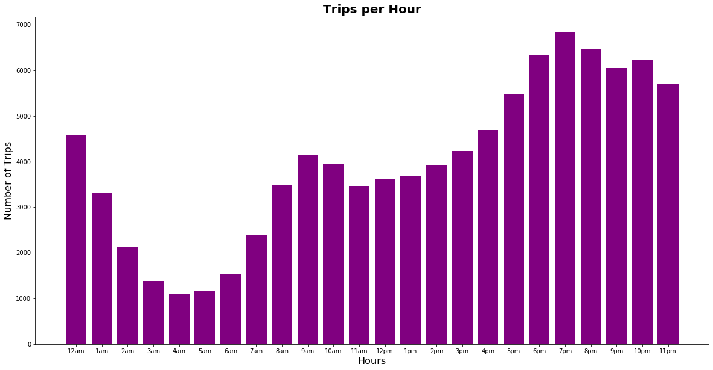
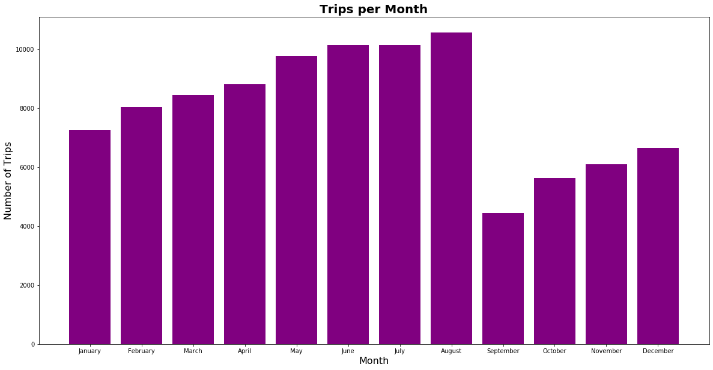

# SMU-Project1-Group3
# ANALYZING UBER TRIPS OCCURED IN NEW YORK CITY

## SUMMARY
Uber has become hugely popular in New York, and its trips outpaced yellow taxis for the first-time last year. There are about 65,000 vehicles affiliated with Uber in the city, which provide more than 400,000 trips per day, according to the Taxi and Limousine Commission. Objective of this study is to provide an analysis of Uber Rides in New York City.

## DATA PREPARATION AND EXPLORATION
We required Uber data specific to New York City that aggregated key ride metrics including trip distance, trip duration, pick-up and drop-off locations and trip date. Data is retrieved from Amazon Web Services (AWS). Data set includes the trips occurred in New York city between September 2014 and September 2015. Data set consists of 31 million rows (1,5 GB size). Random sample of 100 thousand rows of data is used for analysis. 4078 rows of data is ignored because of missing values in the data set. No duplicate values are found in the dataset. In total, 4% of the records are ignored. 96% of original data is retained for data analysis. 

## DATA LIMITATIONS
We do not have direct access to drivers to confirm that the entries in the data set is accurate with regard to distance, location and time. Additionally, we had to remove multiple outliers from the data set, because they were either impossibly short given the distance purportedly traveled or they were exceedingly long in duration, one of which exceeded 7 days. Due to memory constraints, we used 100,000 rows of data, which is relatively small given  the 31 million data points in the source file.

## QUESTIONS  & HYPOTHESES
- Do Uber rides occur more often after work?  
    Hypothesis: There will be a higher prevalence of Uber rides after 5:00 PM in NYC
- Which date of the year is Uber ride requested more?  
    Hypothesis: There will be more trips per day on Christmas and New Year’s Day in NYC
- What is the relationship between trip distance and trip duration?  
    Hypothesis: There is a positive correlation between trip distance and trip duration in NYC  
    Hypothesis: 95% of the variance in trip duration is explained by trip distance in NYC
- What are popular pick-up and drop-off locations?  
    Hypothesis: Some pick-up and drop-off locations will be more popular to others
- What is the relationship between staying in the same neighborhood and distance?  
    Hypothesis: There is a strong association between distance travelled and whether you stay or leave the neighborhood
- What is the relationship between leaving the neighborhood and distance?  
    Hypothesis: There is a negative correlation between Staying in the Neighborhood and the Distance traveled
- What is the difference of trip distance on New Year’s Eve and average trip distance?  
    Hypothesis: Trip distance on New Year’s is longer than average trip distance in NYC

## DATA VISUALIZATION

 
 
 
 
 
 

Please see the full report at https://github.com/ahmedgurbuz/SMU-Project1-Group3/blob/master/report.pdf 
